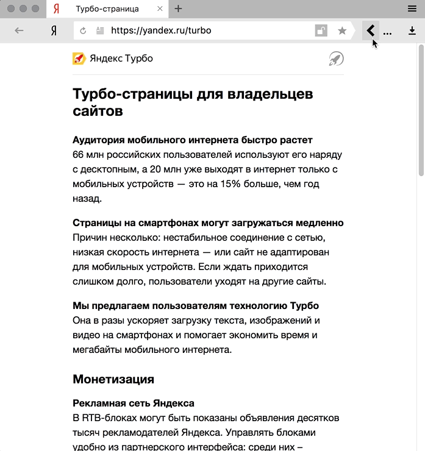
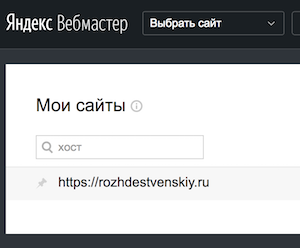

# TurboExtensions
Расширенные возможности стилизации средствами CSS.

[](https://travis-ci.com/turboext/css)

# Прототипирование стилей
1. Установить расширенение [live editor for CSS](https://webextensions.org/) (или любое другое с похожими возможностями);
2. Зайти в браузере на турбо-страницу;
3. Написать CSS для нужных компонентов.



# Ограничения
Ограничения указаны в [конфиге](stylelint.config.js) [stylelint](https://stylelint.io/):
* нельзя использовать пользовательские шрифты;
* нельзя использовать низкопроизводительную анимацию;
* нельзя использовать селекторы по имени тэга;
* нельзя использовать любые внешние ресурсы;
* размер CSS в gzip ограничен 21KB.

На code review могут быть указаны дополнительные требования к коду.

**Важно:** список ограничений может меняться со временем.

# Технические детали
* CSS код будет обработан с помощью [postcss](https://github.com/postcss/postcss). Настройки можно посмотреть в [конфигурационном файле](postcss.config.js).
* Минимальные версии поддерживаемых браузеров
    * android 4
    * iOS 9
    * IE 11

# Внесение изменений в стили
1. Сделать fork репозитория;
1. Создать директорию `hosts/example.com`;
1. В директории должно быть несколько обязательных файлов — `HOSTS.yaml, OWNERS.yaml, style.css`. 
    * `HOSTS.yaml` должен содержать список доменов для которых должны применяться текущие стили, например:
        ```yaml
        - https://www.rozhdestvenskiy.ru
        - https://rozhdestvenskiy.ru
        ```
    Протокол (http, https) обязателен. Фактически, это адрес сайта из https://webmaster.yandex.ru
    
    * `OWNERS.yaml` должен содержать список логинов на https://github.com кому разрешено править стили для текущего домена, например:
    ```yaml
    - sbmaxx
    ``` 
1. Закоммитить изменения и создать PR в основной репозиторий. Желательно в тексте коммита указывать адрес сайта;
1. К PR приложить скриншот с изменениями. Желательно также описать произведённые изменения;
1. Дождаться прохождения линтеров;
1. Дождаться прохождения ревью;
1. Изменения будут доступы в течение часа после вливания PR в master ветку.

# Внесение изменений в инфраструктурную часть
1. [Создать issue](https://github.com/turboext/css/issues/new) с описанием сути изменений;
1. Сделать branch в формате `issues/<номер_issue>`;
1. Закоммитить изменения и создать PR в основной репозиторий;
1. Связать PR и issue (например, c помощью комментария).

# Поддержка разработчиков
https://turbosupport.slack.com, доступ по [приглашениям](https://yandex.ru/turbo?text=turbosupport-slack-access).
